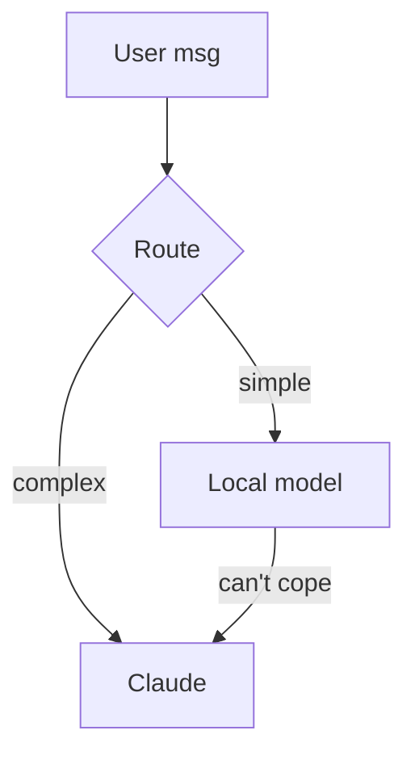

# Mermaid diagrams

Pick the right diagram type for the request and output a single fenced ```mermaid block that renders as-is (GitHub, Notion, many chat UIs, mermaid.live).

## Common types
- Flow / process: `flowchart TD` then `A[Step] --> B{Decision} -->|yes| C[...]`.
- Sequence / interactions: `sequenceDiagram` with `A->>B: message`.
- Data model: `erDiagram` with `USER ||--o{ ORDER : places`.
- Timeline / plan: `gantt`. Ideas: `mindmap`. OOP: `classDiagram`.

## Example


## Rules
- Keep labels short; quote labels with special characters: `A["text (with parens)"]`.
- Build the diagram from the user's real components/steps — don't invent nodes.
- If they want a PNG/SVG file, render with `mmdc` (`npm i -g @mermaid-js/mermaid-cli`) via the shell, else just give the markup.
